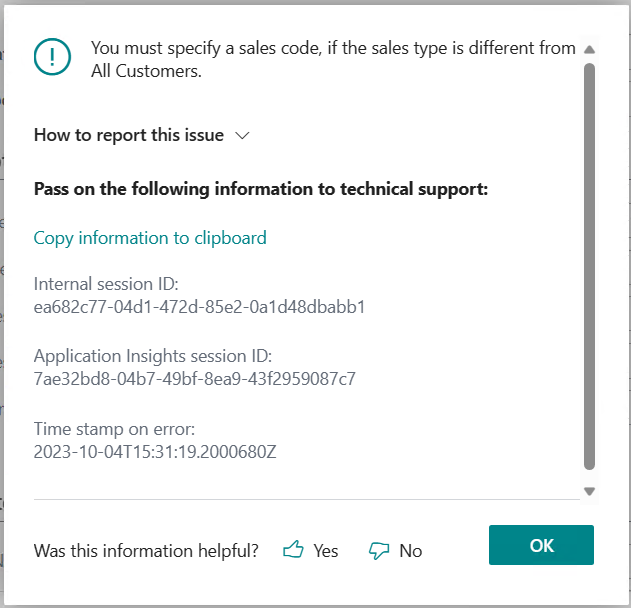
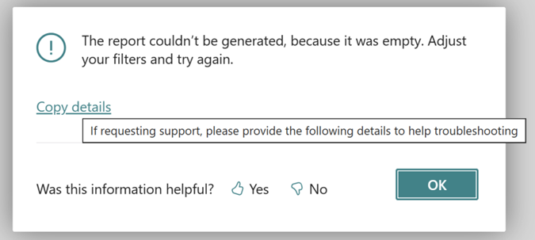

# Understanding the error dialog

The AL language has many error handling features, which can help you deal with unexpected situations that occur when code is run. Whenever an error is surfaced to the user, the [!INCLUDE[prod_short](../developer/includes/prod_short.md)] client displays an error dialog, similar to the figure later in this article. In this article, you can learn more about the different parts of the error dialog so you can more effectively help users mitigate any issues they might encounter.

## Visual elements of the error dialog (2022 release wave 2 and earlier)

In versions 21 and earlier, the error dialog consists of the following four parts:

1. A title (optionally)
2. A message directed to the user
3. A **How to report this issue** part that includes a **Copy information to clipboard** action
4. A yes or no question as to whether the message was helpful

The following figure shows an example of an error dialog in the 2022 release wave 2. 



## Visual elements of the error dialog (2023 release wave 1 and later)

Starting in version 22, the error dialog consists of the following four parts:

1. A title (optionally)
2. A message directed to the user
3. A **Copy Details** action.
4. A yes or no question as to whether the message was helpful

The following figure shows an example and example error dialog in the 2023 release wave 1 or later. 



## Information in Copy details section

The information provided in **Copy details** section is meant for troubleshooting. 

Here's an example of the content of **Copy details**:

```
If requesting support, please provide the following details to help troubleshooting:

The report couldn’t be generated, because it was empty. Adjust your filters and try again.

Internal session ID: 
23fa3850-ea3c-4529-81c8-fc36d3324676

Application Insights session ID: 
2637787e-7dfc-4139-9f83-2b16883b626e

Client activity id: 
9ca384ba-c4a0-eed4-d6df-267a2a40ae5f

Time stamp on error: 
2023-10-04T09:05:40.7201590Z

User telemetry id: 
7979ab03-7b75-455e-beed-505c7b2649fb

AL call stack: 
Report1(Report 50101).OnPostReport(Trigger) line 2 - ReportErrors by Default publisher
```

The error messages supplied to the user are listed below the line `If requesting support, please provide the following details to help troubleshooting:`. Optionally, messages are in _DetailedMessage_ if the AL developer used the ErrorInfo version of the [Error method](methods-auto/dialog/dialog-error-errorinfo-method.md). 


After the error messages, the platform adds more sections that can be useful when troubleshooting. The following table explains these additional sections in **Copy details**.


|Section | Description |
|--------|-------------|
|Internal session ID| An internal session ID that is used by the [!INCLUDE[azure-appinsights-name](../includes/azure-appinsights-name.md)] support team in case the issue needs to be reported as support case.|
|Application Insights session ID| The session ID. This ID is recorded in the `operationId` field in the telemetry logged to [!INCLUDE[azure-appinsights-name](../includes/azure-appinsights-name.md)] | 
|Client activity ID| An internal session ID that is used by the [!INCLUDE[azure-appinsights-name](../includes/azure-appinsights-name.md)] support team in case the issue needs to be reported as support case.|
|Time stamp on error| The date and time (in UTC timezone) for when the error occurred. |
|User telemetry ID | [!INCLUDE[user_Id](../includes/include-telemetry-user-id.md)] | 
|AL call stack | The AL stack trace in the session when the error occurred.| 


There are three pieces of information that help you better understand the error that the user experienced:

1. The error messages
2. Application Insights session ID (if telemetry is enabled in the environment/app)
3. The AL stack trace

### Sample KQL code (troubleshoot further with telemetry)

In telemetry, use this KQL code to help you understand what happened in the session prior to the error.

```kql
traces
| where timestamp > ago(1d) // adjust as needed
| where operation_Id == '<insert Application Insights session ID here>'
| project timestamp
, message
, eventId = customDimensions.eventId 
, customDimensions
| order by timestamp asc
```

### Understanding the AL stack trace

Whenever an operation in AL is started, the operation is added to a data structure called the _AL stack_. When the operation completes, it's removed from the AL stack. This way, the AL stack trace is then showing what AL was currently running in the session. For each operation, the object the operation comes from and details about the app are also logged.

#### Example

Consider the following AL stack trace: 

```
"Payment Application Proposal"(Table 1293).ValidateEntryNotApplied line 12 - Base Application by Microsoft
"Payment Application Proposal"(Table 1293)."Applied - OnValidate"(Trigger) line 17 - Base Application by Microsoft
"Bank Acc. Reconciliation Line"(Table 274).DisplayApplication line 27 - Base Application by Microsoft
"Payment Application Review"(Page 1287)."ApplyEntries - OnAction"(Trigger) line 3 - Base Application by Microsoft
"Payment Reconciliation Journal"(Page 1290)."Match Confidence - OnDrillDown"(Trigger) line 8 - Base Application by Microsoft
```

The first operation in the stack is found in the bottom line: the _Match Confidence - OnDrillDown"(Trigger)_ from the "Payment Reconciliation Journal" page (object ID 1290) residing in the app _Base Application_ by the publisher _Microsoft_. This line is where execution started. The error happened in the operation in the top of the stack: _ValidateEntryNotApplied_ in the "Payment Application Proposal" table (object 1293) residing in the app _Base Application_ by the publisher _Microsoft_.

You can then use the stack trace to identify:

1. What the user was doing (the bottom of the stack trace)
2. Where the error happened (the top of the stack trace)

## Error message telemetry

When a user gets an error dialog while working in [!INCLUDE[prod_shoirt](../includes/prod_short.md)], a telemetry signal is also emitted, which can be logged in an [!INCLUDE[appInsights](../includes/azure-appinsights-name.md)] resource. This telemetry data let's you identify and analyze calls to the `Error` method from AL code. You can also set up alerts in [!INCLUDE[appInsights](../includes/azure-appinsights-name.md)] to get notified if many users experience errors.

For more information, see [Error method trace telemetry](../administration/telemetry-error-method-trace.md).

The error dialog also includes a yes or no question as to whether the message was helpful, similar to the following illustration:


If a user selects either **Yes** or **No**, a signal is emitted and recorded in [!INCLUDE[azure-appinsights-name](../includes/azure-appinsights-name.md)]. This information can help partners and developers get insight into error messages that users find hard to understand. They can then follow up with the customer to help out.

For more information, see [Analyzing Error Message Quality Telemetry](../administration/telemetry-error-message-voting-trace.md).

## See also

[Failure modelling and robust coding practices](devenv-robust-coding-practices.md)  
[Error message quality telemetry](../administration/telemetry-error-message-voting-trace.md)   
[Error method telemetry](../administration/telemetry-error-method-trace.md)   
[Permission error telemetry](../administration/telemetry-permission-error-trace.md)   
[AL error handling](devenv-al-error-handling.md)   
[AL Control Statements](devenv-al-control-statements.md)   
[AL Development Environment](devenv-reference-overview.md)   