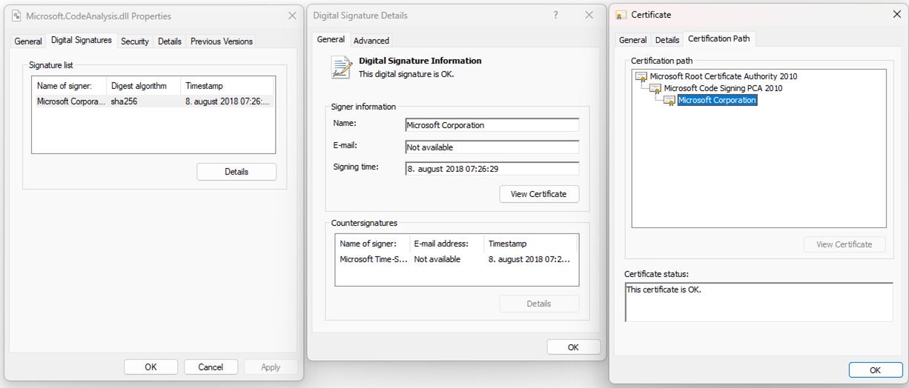

# Sign an app package file

Code signing is a common practice for many applications. It's the process of digitally signing a file to verify the author and that the file hasn't been tampered with since it was signed. The signature of the app package file is verified during the publishing of the extension using the `Publish-NAVApp` cmdlet. For more technical information on signing, see [Authenticode](/previous-versions/windows/internet-explorer/ie-developer/platform-apis/ms537359(v=vs.85)).

> [!NOTE]  
> If you want to publish an unsigned extension package in your on-premise environment, you need to explicitly state it by using the - *SkipVerification* parameter on the `Publish-NAVApp` cmdlet. An extension without a valid signature won't be published on AppSource. 

The signing of an app package file must be performed on a computer that has [!INCLUDE[d365fin_long_md](includes/d365fin_long_md.md)] installed. If you're running [!INCLUDE[d365fin_long_md](includes/d365fin_long_md.md)] on Docker for your development environment, that environment will meet this requirement. You must also have the certificate that will be used for signing on the computer. The certificate must include code signing as the intended purpose. It's recommended that you use a certificate purchased from a third-party certificate authority.


## Steps for signing your .app file

1. Prepare your computer for signing. 
2. Make sure that you sign the .app file on a Microsoft Windows computer that has [!INCLUDE[d365fin_long_md](includes/d365fin_long_md.md)] installed.
3. Copy the certificate that you purchased from a third-party certificate authority to a folder on the computer. The example uses a pfx version of the certificate. If the certificate you purchased isn't in a pfx format, create a pfx file. There are resources online, which can help you convert a certificate to `.pfx` format. The file path for the sample command is `C:\Certificates\MyCert.pfx`. (Optionally, create your own certificate for local test or development purposes using the [Self-signed certificate](#self-signed-certificate) information).
4. Install a signing tool such as [SignTool](/dotnet/framework/tools/signtool-exe) or [SignCode](/previous-versions/windows/internet-explorer/ie-developer/platform-apis/ms537364(v=vs.85)) to the computer. The sample command will use SignTool.
5. Copy your extensions .app file to the computer if it's not already on the computer. The file path for the sample command is `C:\NAV\Proseware.app`.
6. Run the command to sign the .app file.  
7. The following example signs the Proseware.app file with a time stamp using the certificate in the password-protected MyCert.pfx file. The command is run on the computer that was prepared for the signing. Once the command has been run, the Proseware.app file has been modified with a signature. This file is then used when publishing the extension.

```
SignTool sign /f C:\Certificates\MyCert.pfx /p MyPassword /t http://timestamp.verisign.com/scripts/timestamp.dll “C:\NAV\Proseware.app”
```

> [!IMPORTANT]  
> It's recommended to use a time stamp when signing the app package file. A time stamp allows the signature to be verifiable even after the certificate used for the signature has expired. For more information, see [Time Stamping Authenticode Signatures](/windows/win32/seccrypto/time-stamping-authenticode-signatures). Depending on the certification authority, you may need to acquire a specific certificate in order to time stamp, an [Extended Validation](https://www.digicert.com/code-signing/ev-code-signing/) certificate from DigiCert for example.

> [!NOTE]  
> If you are using the BCContainerHelper PowerShell module to run [!INCLUDE[d365fin_long_md](includes/d365fin_long_md.md)] on Docker, you can use the function `Sign-BCContainerApp` to perform all the steps above.

## Self-signed certificate

For testing purposes and on-premises deployments, it's acceptable to create your own self-signed certificate. You can do so using the [New-SelfSignedCertificate](/powershell/module/pki/new-selfsignedcertificate) cmdlet in PowerShell on Windows 10 or [MakeCert](/windows/desktop/SecCrypto/makecert).  

The following example illustrates how to create a new self-signed certificate for code signing:

```
New-SelfSignedCertificate –Type CodeSigningCert –Subject “CN=ProsewareTest”
```

The following (deprecated) MakeCert command is used to create a new self-signed certificate for code signing:

```
Makecert –sk myNewKey –n “CN=Prosewaretest” –r –ss my
```


## Code signing for AppSource

If you publish the extension as an app on AppSource, the app package file must be signed using a certificate purchased from a Certification Authority (CA); a self-signed certificate will not be accepted by the technical validation. The CA must have its root certificates in Microsoft Windows. You can obtain a certificate from a range of certificate providers, including but not limited to DigiCert and Symantec, see the image below. You don't have to use an EV Code Signing certificate, standard code signing certificates can be used for signing your extensions.

You can check the validity of your code signing by transferring your signed app file to a Windows device which did not sign it. Right-click on the file and go to Properties, Digital Signatures, and then Details. In this pop-up, choose View Certificate and finally go to Certification Path. It should look similar to the below example (though it's a Microsoft binary file):



If the Certification Path has only one entry then the file isn't signed correctly and will be rejected by AppSource technical validation.

## See Also
[Get Started with AL](devenv-get-started.md)  
[Keyboard Shortcuts](devenv-keyboard-shortcuts.md)    
[AL Development Environment](devenv-reference-overview.md)   
[Questions about code-singing validation](devenv-checklist-submission-faq.md#questions-about-code-signing-validation)
