# Power Pages on virtual tables (preview)

[!INCLUDE[public_preview_disclaimer](includes/public_preview_disclaimer.md)]

Data virtualization is part of the fabric of the tools to integrate Business Central online with Microsoft Dataverse. To learn more about Dataverse integration, consult [Business Central & Dataverse integration](https://github.com/microsoft/d365bcdv/blob/main/Review%20of%20Business%20Central%20and%20Dataverse%20integration.pdf). Data virtualization allows users with Business Central licenses and entitlements to access data stored in Business Central online by performing (**C**reate/**R**ead/**U**pdate/**D**elete) API operations on Business Central tables that are available as virtual tables in Dataverse.  

These licensed users are considered as internal users to the organizations or companies that purchase the licenses. They're in employee-like relationships with the companies and perform business processes on the companies' behalf. They can access data stored in Business Central online using Power Apps and Power Automate, which operate on virtual tables in Dataverse.

Business Central 2023 release wave 1, version 23.1, introduced Power Pages on virtual tables feature. This feature allows unlicensed external users to access data stored in Business Central online by using Power Pages that operates on virtual tables in Dataverse.  For more info on internal and  external users, consult the [Dynamics 365 licensing guide](https://go.microsoft.com/fwlink/?LinkId=866544&clcid=0x409) and refer to the **Licensing requirements for external users** and **Multiplexing** sections.

External users are typically users from the customer or vendor organizations of companies that purchase Business Central licenses.  In some commerce or collaboration scenarios, these users might need to participate in processes that involve data stored in Business Central online, such as customer onboarding, vendor bidding, and so on&mdash;even if they aren’t Business Central users. This new feature enables those companies to build business-to-business (B2B) portals using Power Pages that serve their customers and vendors, so external users can have anonymous and authenticated access to data stored in Business Central online.  

Anonymous access via Power Pages allows external users to perform API operations on Business Central tables without signing in. Authenticated access via Power Pages requires external users to sign in to perform API operations on Business Central tables or rows that are accessible to them. Business Central admins can select only the necessary API operations, tables, and rows to be enabled for anonymous and authenticated access by external users. Additionally, this feature also enables authenticated access via Power Pages for internal and existing Business Central users, similar to authenticated access via Power Apps and Power Automate. 

This article highlights the new feature of Power Pages on virtual tables, the prerequisites and step-by-step instructions to preview it, its current limitations, and future improvements.

## Prerequisites and step-by-step instructions

To preview the new feature of Power Pages on virtual tables, complete the following tasks:

1. Create or upgrade a Business Central environment with Dynamics 365 Business Central 2023 release Wave 2 (version 23.1 or later).
1. In Business Central, use the assisted setup guide to connect your Business Central environment to a Dataverse environment in which you want to make your Business Central tables available as virtual tables. This task guides you to install the **Business Central Virtual Table** app from AppSource.

   For more information, go to [Connect Business Central online to Dataverse](#connect) in this article.
1. In Business Central, admins can assign permission sets to the built-in app and service-to-service (S2S) users that must access data stored in Business Central online via Power Pages on behalf of anonymous and authenticated external users.  
   
   For more information, go to [Assign permission sets to anonymous and authenticated external users](#s2s) in this article.
1. In Power Apps maker portal, launch the *Business Central Configuration* app to select virtual Business Central tables, such as *Customer*/*Item*/*Sales Order*/*Sales Invoice*/*Sales Shipment*/*Vendor* tables, and make them visible.

   For more information, go to [Make virtual Business Central tables visible on Dataverse](#visible) in this article.
1. In Power Apps maker portal, open the native Dataverse *Contact* table and add lookup columns to the virtual Business Central *Customer*/*Vendor* tables.

   For more information, go to [Add lookup columns on Dataverse Contact table](#lookup) in this article.
1. In the **Business Central Configuration** app, create synthetic relations between the native Dataverse **Contact** table and virtual Business Central tables, such as **Sales Order**, **Sales Invoice**, and **Sales Shipment**.

   For more information, go to [Create synthetic relations for Dataverse Contact table](#synthetic) in this article.
1. In Power Pages maker portal, create pages for anonymous access of external users.

   For more information, go to [Enable anonymous access for external users via Power Pages](#anonymous) in this article.
1. In Power Pages maker portal, create pages for authenticated access of external users.

   For more information, go to [Enable authenticated access for external users via Power Pages](#authenticated) in this article.
1. (Optional) In Power Pages maker portal, create pages for authenticated access of internal users.

   For more information, go to [Enable authenticated access for internal users via Power Pages](#internal) in this article.
1. (Optional) In Power Pages maker portal, make virtual Business Central tables editable as Power Pages lists.
  
   For more information, go to [Enable edit mode on Power Pages lists](#editlist) in this article.
1. (Optional) In Power Pages maker portal, make virtual Business Central tables editable as Power Pages subgrids.

   For more information, go to [Enable edit mode on Power Pages subgrids](#editsubgrid) in this article.

## Connect Business Central online to Dataverse

To connect your Business Central environment to a Dataverse environment in which you want to make your Business Central tables available as virtual tables, complete the following steps:

1. Sign in to [Business Central](https://businesscentral.dynamics.com/).
1. Select **Settings** icon > **Assisted setup** > **Set up a connection to Dataverse** to open the **Dataverse Connection Setup** assisted setup guide.  
1. Turn on the **Enable virtual tables and events** switch and then select **Next**.

   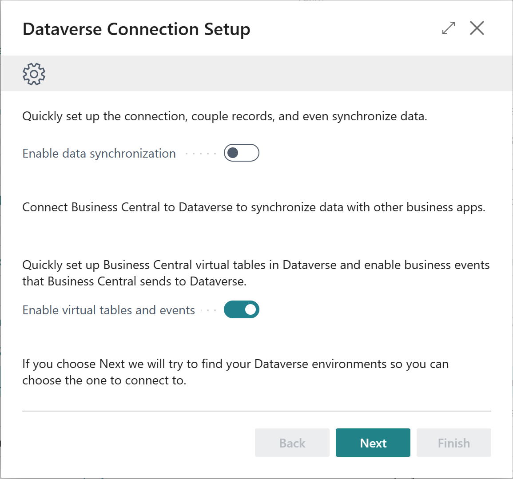

1. Review the terms and conditions. If you want to accept, turn on the **I accept** switch, and then select **Next**.
1. Specify your Dataverse environment URL, sign in as an administrator user, and then select  **Next**.
1. Install the **Business Central Virtual Table** app from AppSource, and then select the **Finish** button.

   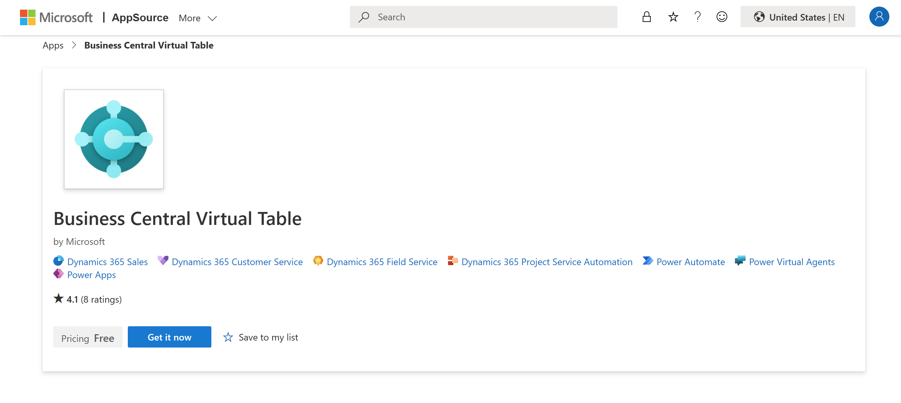

## Assign permission sets to anonymous and authenticated external users

Because external users have no Business Central license or entitlements, we included built-in app/S2S users to access data stored in Business Central online on their behalf. Permission sets can be assigned to these app/S2S users to control data access by external users. To do so, complete the following steps:

1. In [Business Central](https://businesscentral.dynamics.com/), search for and open the **Microsoft Entra Applications** page.

   There are three built-in app/S2S users:
   
   - **Dynamics 365 Business Central for Virtual Tables** for accessing data stored in Business Central online via Power Apps, Power Automate, and Power Pages by personifying authenticated internal users.
   - **Power Pages Anonymous External Users** for accessing data stored in Business Central online via Power Pages on behalf of anonymous external users.
   - **Power Pages Authenticated External Users** for accessing data stored in Business Central online via Power Pages on behalf of authenticated external users.

   

1. Open the **Power Pages Anonymous External Users** card, set the **State** field to **Enabled**, and assign permission sets with the appropriate scope for anonymous external users, for example read-only for certain tables and LOGIN permission set as a minimum.

   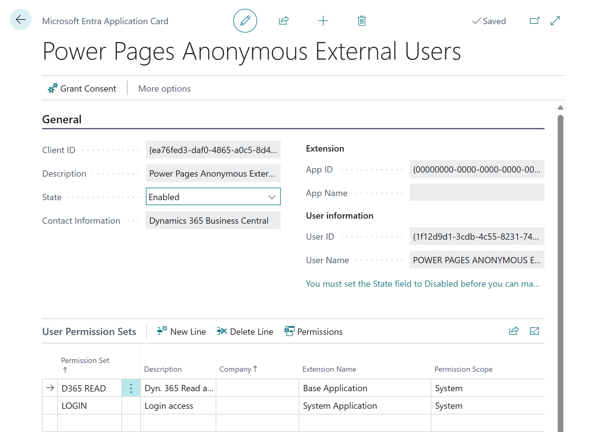

1. Open the **Power Pages Authenticated External Users** card, set the **State** field to **Enabled**, and assign permission sets with the appropriate scope for authenticated external users, for example read-write for certain tables and LOGIN permission set as a minimum.

   <!--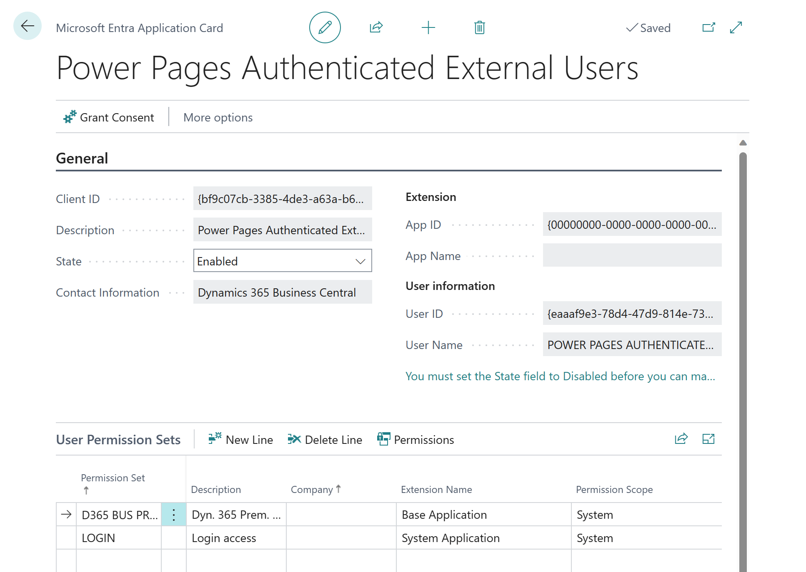-->

## Make virtual Business Central tables visible on Dataverse

To make virtual Business Central tables visible on Dataverse, follow these steps:

1. In [Power Apps maker portal](https://make.powerapps.com/), select the **Apps** section, and launch the **Business Central Configuration** app.

   

1. In the **Business Central Configuration** app, complete the following steps:

   1. Select the **Available Tables** section.
   2. Select the virtual Business Central tables to be made visible, such as **Customer**, **Item**, **Sales Order**, **Sales Invoice**, **Sales Shipment**, and **Vendor** tables.
   3. Select **Edit**.
   3. Select the **Visible** check box, and then select **Save**.

   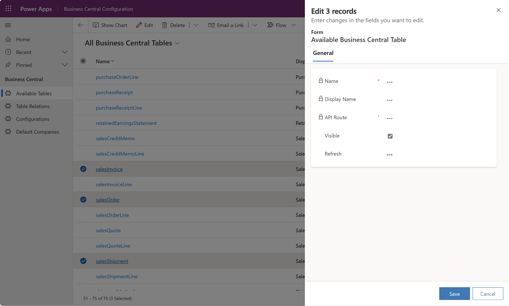
 
## Add lookup columns on Dataverse Contact table

Because Power Pages authentication is linked to Dataverse **Contact** table, external users who sign in as contacts from customer or vendor organizations should only access their customer&mdash;or vendor-specific data. This task can be done by first adding lookup columns on Dataverse **Contact** table to the virtual Business Central *Customer** or **Vendor** tables.  To do so, follow these steps:

1. In [Power Apps maker portal](https://make.powerapps.com/), select the **Tables** section, select the **Contact** table, select the **Columns** icon, and then select **+ New column**.
1. Enter a descriptive display name for the lookup column, for example, *BC Customer*/*BC Vendor*
1. Set the **Data type** field to **Lookup**, set the **Related table** field to **Customer** or **Vendor**, and then select **Save**.

   

## Create synthetic relations for Dataverse Contact table

Because Power Pages authentication is linked to the Dataverse **Contact** table, external users who sign in as contacts from customer or vendor organizations should only access their customer/vendor-specific data. Only rows in virtual Business Central tables that are associated with the signed-in contacts should be shown. You can set up this behavior by creating synthetic relations between the native Dataverse **Contact** table and virtual Business Central tables, such as **Sales Order**, **Sales Invoice**, and **Sales Shipment** tables.  Follow these steps:

1. In [Power Apps maker portal](https://make.powerapps.com/), add lookup columns on Dataverse **Contact** table. To learn more, go to [Add lookup columns on Dataverse Contact table](#lookup).
1. Select the **Tables** section, **Contact** table, **Keys** icon, and **+ New key**.
1. Enter a descriptive display name for your key, for example *bccustomerkey*/*bcvendorkey*.
1. Select *BC Customer* or *BC Vendor* in the **Columns** fields, and then select **Save**

  If multiple contacts are associated with one customer or vendor, you can select more columns, such as **Business Phone** or **Email**, to show only rows in virtual Business Central tables that are associated with the specific signed-in contacts.

   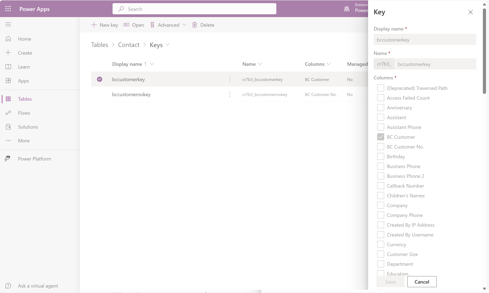

1. Select the **Apps** section, and launch the **Business Central Configuration** app.

   

1. In the **Business Central Configuration** app, select the **Table Relations** section, and then select **+ New**.
1. On the **General** tab, enter the appropriate field values.  For example, to create a synthetic relation between the native Dataverse **Contact** table and virtual Business Central **Sales Order** table, fill in the properties, for example:

   - a descriptive display name, like *dyn365bc_contact2salesorder*, for the **Relation Name** field, 
   - *contact* for the **Native Table** field
   - the schema name of your key, like *cr7b3_bccustomerkey*, for the **Native Table Key** field
   - *dyn365bc_salesorder_v2_0* for the **Virtual Table** field.

   

1. On the **Mappings** tab, enter the schema names of **Native columns** that map to those of **Virtual columns**.  For example, *cr7b3_bccustomerkey* that maps to *dyn365bc_customer_customerid*.

   

1. Select **Save & Close**.

## Enable anonymous access for external users via Power Pages

To create pages for anonymous access of external users, follow these steps:

1. In [Power Pages maker portal](https://make.powerpages.microsoft.com/), create a new B2B portal by selecting a template from the **Templates** section, and selecting **Done**.
1. Select the **Edit** button for your portal.
1. Select the **+ Page** button, enter a descriptive display name for your page, for example *BC Items* for a page showing the virtual Business Central **Item** table, and select the **Add** button.
   
   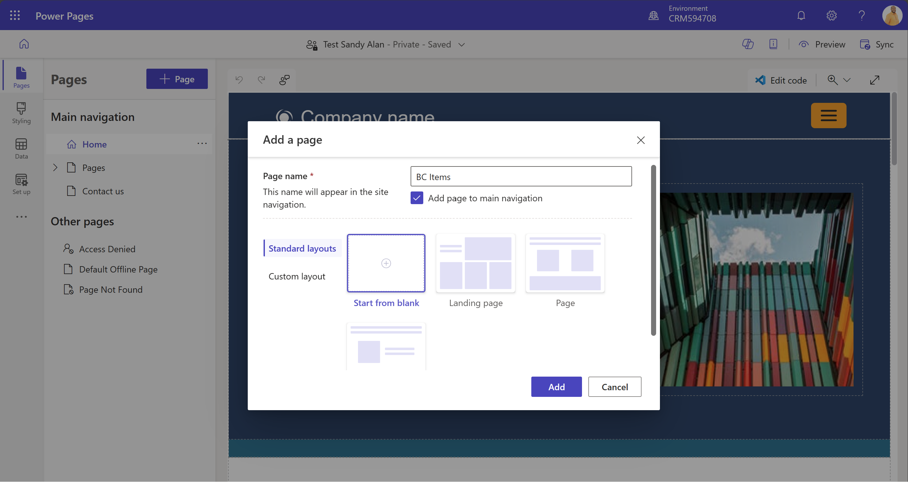
   
1. Drag *BC Items* to the **Pages** section.
1. Select the **List** item, and then select **+ New list**.

   
   
1. Search and select the virtual Business Central **Item** table.
1. Select the **All Items** view and then select **Done**.

   
   
1. Select **Permission** button, select the **All Items** permission, and then select **Global access** type.
1. Add the **Read** permission and **Anonymous Users** role. This step enables external users to visit your portal without signing in and **Business Central Virtual Table** app will use **Power Pages Anonymous External Users** app/S2S user to access data stored in Business Central online on their behalf.

   
   
1. Select **Save** > **Sync**.
1. Select **Preview** to check that external users can see the *Item* table from Business Central without signing in.

   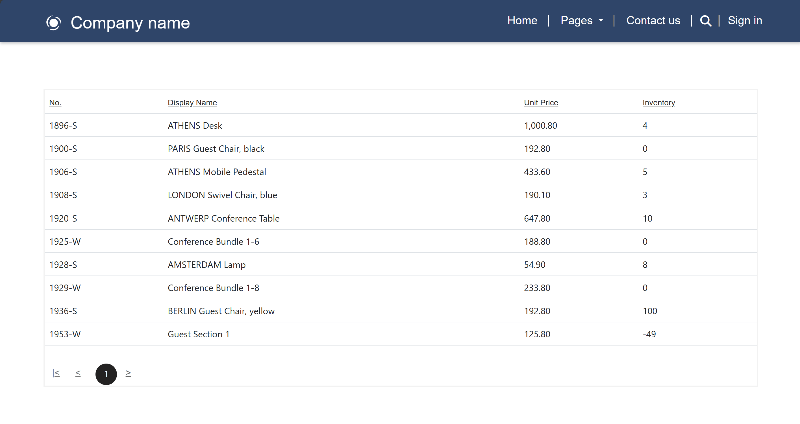

## Enable authenticated access for external users via Power Pages

To create pages for authenticated access of external users, follow these steps:

1. In [Power Pages maker portal](https://make.powerpages.microsoft.com/), create a new B2B portal by selecting a template from the **Templates** section, and then selecting **Done**.
1. Select **Edit** for your portal.
1. Select **+ Page**, enter a descriptive display name for your page, for example *BC Sales Orders* for a page showing the virtual Business Central *Sales Order* table, and select **Add**.
1. Drag *BC Sales Orders* to the **Pages** section.
1. Select the **List** item, and then select **+ New list**.
1. Search and select the virtual Business Central **Sales Order** table.
1. Select the **All Sales Orders** view and then **Done**.
1. Select the **Permission** button, select the **All Sales Orders** permission, select **Contact access** type. Then, select a synthetic relation between the native Dataverse **Contact** table and virtual Business Central **Sales Order** table, for example *dyn365bc_contact2salesorder*.
1. Add all except **Delete** permissions and **Authenticated Users** role. This step enables external users to sign in to your portal with their contact user identity and **Business Central Virtual Table** app will use *Power Pages Authenticated External Users* app/S2S user to access data stored in Business Central online on their behalf.

   
   
1. Select **Save**, and then select **Sync**.
1. Select **Preview** to check that external users can see the **Sales Order** table from Business Central after signing in.

   

## Enable authenticated access for internal users via Power Pages

To create pages for authenticated access of internal users, follow the same steps as described in the [Enable anonymous access for external users via Power Pages](#anonymous) and  [Enable authenticated access for external users via Power Pages](#authenticated) sections and add **Administrators** role. This task enables internal users to sign in to your portal with their Microsoft Entra user identity and **Business Central Virtual Table** app personifies them using *Dynamics 365 Business Central for Virtual Tables* app/S2S user to access data stored in Business Central online.

## Enable edit mode on Power Pages lists

To enable edit mode on Power Pages lists, follow these steps:

1. In [Power Pages maker portal](https://make.powerpages.microsoft.com/), select **Edit** for your portal. In the **Set up** section, select **...** and then select the **Power Pages Management** option to open Power Pages Management portal in another tab.
1. In **Power Pages Management** portal, select the **Basic Forms** section and then select **+ New**.
1. Enter a descriptive display name for the **Name** field, for example *YourAlias Sales Order Basic Form*, and *ID* for the **Record ID Parameter Name** field.
1. Set the following values for fields:
   
   - **Sales Order (dyn365bc_salesorder_v2_0)** for the **Table Name** field
   - **Information** for the **Form Name** field
   - **Edit** for the **Mode** field
   - **Query String** for the **Record Source Type** field
   - Your portal name for the **Website** field, and **Save** button.

   
   
1. Select the **List** section, **All Sales Orders** list, **Options** tab, **+ Edit**  in **Grid configuration** section.

2. Set the **Target Type** field to **Basic Form**, the **Basic Form** field to **YourAlias Sales Order Basic Form**, and then select **Save**.

   
   
1. Because the default sales order form has been designed to include a subgrid of sales order lines, authenticated users also need to be assigned all except **Delete** permissions to access the virtual Business Central **Sales Order Line** table.

   

1. Select **Save** and then **Sync**.
1. Select the **Preview** button to check that external users can edit the Sales Order lists from Business Central after signing in.

   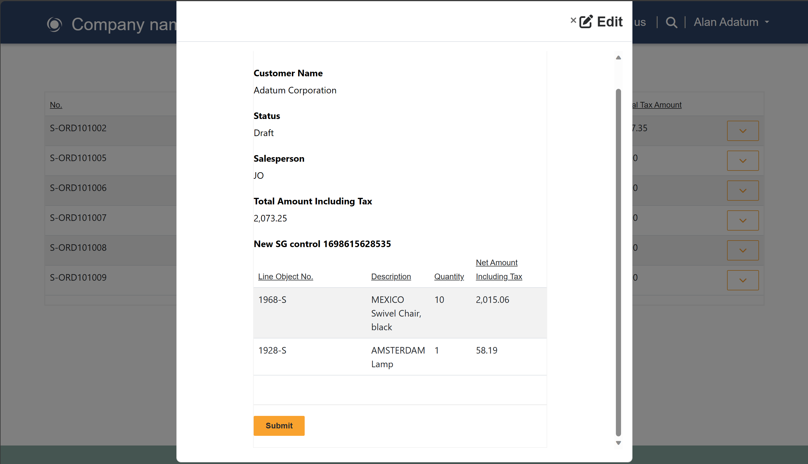

## Enable edit mode on Power Pages subgrids

To enable edit mode on Power Pages subgrids, follow these steps:

1. In [Power Pages maker portal](https://make.powerpages.microsoft.com/), select **Edit** for your portal. In the **Set up** section, select **...** and then select the **Power Pages Management** option that opens Power Pages Management portal in another tab.
1. In Power Pages Management portal, select the **Basic Forms** section and then select **+ New**.
1. Enter a descriptive display name for the **Name** field, for example *YourAlias Sales Order Line Basic Form*, and *ID* for the **Record ID Parameter Name** field.
1. Set the following values for fields:
   
   - **Sales Order Line (dyn365bc_salesorder_v2_0)** for the **Table Name** field
   - **Information** for the **Form Name** field
   - **Edit** for the **Mode** field
   - **Query String** for the **Record Source Type** field
   - Your portal name for the **Website** field, and **Save** button.
1. Select **YourAlias Sales Order Basic Form**, select the **Basic Form Metadata** tab, then select **+ New Basic Form Metadata**. Set the following values fo fields:

   - **Subgrid** for the **Type** field
   - **Subgrid_new_1** for the **Subgrid Name** field
1. In the **Grid configuration** section, select **+ Edit** and set the following values in fields:

   - **Basic Form** for the **Target Type** field
   - **YourAlias Sales Order Line Basic Form** for the **Basic Form** field

   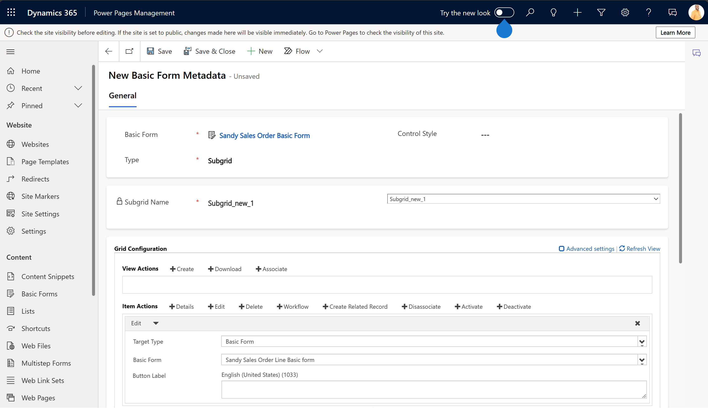
   
1. Select **Save** and then select  **Sync**.
1. Select **Preview** to check that external users can edit the Sales Order Line subgrids linked to Sales Order lists from Business Central after signing in.

   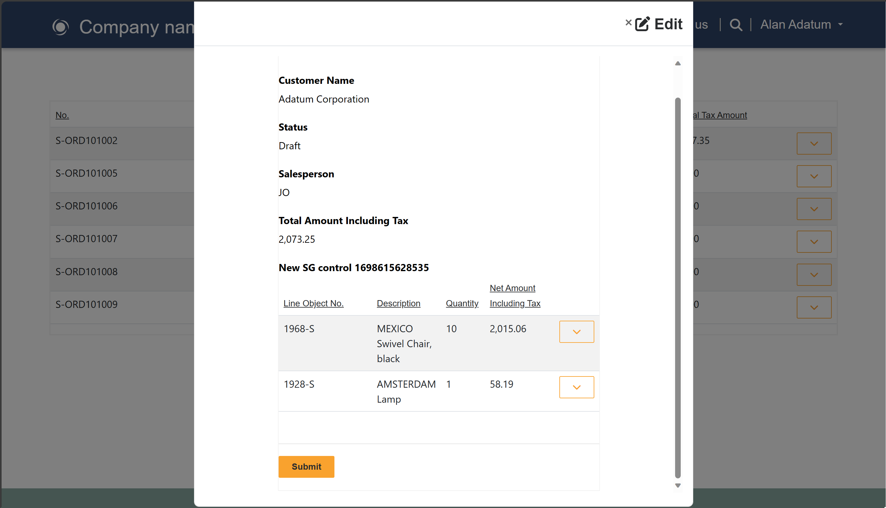

## Current limitations and future improvements

The following list includes the current limitations for Power Pages on virtual tables that will be removed or improved in future update:
1. Anonymous access for external users via Power Pages supports read-only for now.
1. Authenticated access for external users via Power Pages supports only lookups to customers/vendors of Business Central company configured in the virtual table global settings for now.